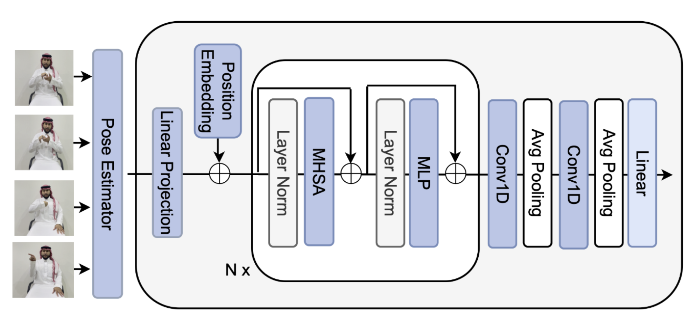

# Pose Estimation for MSLR CSLR Track

Welcome to the Pose Estimation repository! This repository contains the starter kit for the **MSLR CSLR Track** and provides a simple baseline for two important tasks in Continuous Sign Language Recognition (CSLR).

The tasks include:
1. **Signer Independent** [View Competition](https://www.kaggle.com/competitions/continuous-sign-language-recognition-iccv-2025)
2. **Unseen Sentences** [View Competition](https://www.kaggle.com/competitions/continuous-slr-task-2-iccv-2025)

## Update_MSLR-2025 (follow this folder for updated code)
---
---
- `cd Update_MSLR-2025/`

#### run the code for both training and inference 

- mode = SI (train)
```bash
python run.py --train --mode SI --model SOTA_CSLR
```

- mode = SI (infer)
```bash
python run.py --infer --mode SI --model SOTA_CSLR
```

---

- mode = US (train)
```bash
python run.py --train --mode US --model AdvancedSignLanguageRecognizer
```

- mode = US (infer)
```bash
python run.py --infer --mode US --model AdvancedSignLanguageRecognizer
```

---
---

### Model Performance (US Mode)

|        Model                   | Mode | Dev (WER) | Test (WER) |
|--------------------------------|------|-----------|------------|
| llm_advslowfast                | US   | 93.0663 | ...        |
| gcn_transformer                | US   | 91.7951   | ...        |
| mixllama                       | US   | 86.9029   | ...        |
| LLM Backbone (DistilBERT)      | US   | 81.7026   | ...        |
| slowfast                       | US   | 81.3174   | ...        |
| LSTM                           | US   | 79.9307   | ...        |
| SignLanguageConformer          | US   | 77.5039   | ...        |
| SignLanguageRecognizer         | US   | 74.9614   | ...        |
| SOTA_CSLR                      | US   | 64.4838   | ...        |
| MambaSignLanguageRecognizer    | US   | 59.514    | ...        |
| AdvancedSignLanguageRecognizer | US | **55.0847** | **47.7756** |


## Baseline Overview

We use a simple **Transformer model** to produce the baseline for these tasks. The architecture of the baseline model is shown below:



| Task              | Baseline Dev (WER) |
|-------------------|----------|
| **Signer Independent** | 46.53% |
| **Unseen Sentences**    | 92.75% |

## Setup Instructions

Follow these steps to set up the environment and get started:

1. **Clone the repository**:
   ```bash
   git clone https://github.com/gufranSabri/Pose86K-CSLR-Isharah.git
   cd Pose86K-CSLR-Isharah
   ```

2. **Download the dataset** from [here](https://www.kaggle.com/competitions/continuous-sign-language-recognition-iccv-2025/data). Place the dataset in the `./data` folder.

3. **Set up the Python environment**:
   - Install `virtualenv`:
     ```bash
     pip install virtualenv
     ```

   - Create a virtual environment and activate it:
     ```bash
     python<version> -m venv pose
     source pose/bin/activate  # On Windows: pose\Scriptsctivate
     ```

   - Install the required dependencies:
     ```bash
     pip install torch==1.13 torchvision==0.14 tqdm numpy==1.23.5 pandas opencv-python
     git clone --recursive https://github.com/parlance/ctcdecode.git
     cd ctcdecode && pip install .
     ```


## Running the Model
Once your environment is ready and the data is in place, you can run the main script using the following format:
```
python main.py \
  --work_dir ./work_dir/test \
  --data_dir ./data \
  --mode SI \
  --model base \
  --device 0 \
  --lr 0.0001 \
  --num_epochs 300
```

### Argument Descriptions
 * ```--work_dir:``` Path to store logs and model checkpoints (default: ./work_dir/test)
 * ```--data_dir:``` Path to the dataset directory (default:``` /data/sharedData/Smartphone/)
 * ```--mode:``` Task mode, either SI (Signer Independent) or US (Unseen Sentences)
 * ```--model:``` Model variant to use (base, or any other available variant)
 * ```--device:``` GPU device index (default: 0)
 * ```--lr:``` Learning rate (default: 0.0001)
 * ```--num_epochs:``` Number of training epochs (default: 300)

You can modify these arguments as needed for your experiments.

### Example Command

- Task-1:
```
python main.py --work_dir ./work_dir/base_SI --model base --mode SI
```

- Task-2:
```
python main.py --work_dir ./work_dir/base_US --model base --mode US
```

## Usage

Once the environment is set up, you can train or test the model on the available tasks. Follow the instructions in the individual task directories for specific commands.

### Running the Script for Inference the best model

#### Task-1 (SI)
```bash
python inference_submission.py \
    --work_dir ./work_dir/base_SI \
    --mode SI \
    --model base \
    --device 0 \
    --output_dir ./submission/task-1
```

#### Task-2 (US)
```bash
python inference_submission.py \
    --work_dir ./work_dir/base_US \
    --mode US \
    --model base \
    --device 0 \
    --output_dir ./submission/task-2
```

Replace `--model base` with `llm`, `slowfast`, `stgcn_conformer`, or `st_transformer` depending on the model used. Update `work_dir` to match the training directory containing `best_model.pt`.

### Running `test_evaluate.py` the best model

#### Task-1 (SI)
```bash
python test_evaluate.py --work_dir ./work_dir/llm_advslowfast_SI --model llm_advslowfast --mode SI --device 0
```

#### Task-2 (US)
```bash
python test_evaluate.py --work_dir ./work_dir/llm_advslowfast_US --model llm_advslowfast --mode US --device 1
```


```
MSLR-Pose86K-CSLR-Isharah/
│
├── main.py                      # Main training/validation script
├── inference_submission.py      # Inference and submission script
├── data_loader_test.py          # dataloader process for the test set only
├── test_script.py               # testing dataset
│
├── models/
│   ├── transformer.py           # Transformer-based CSLR model(s)
│   └── gcn_transformer.py       # gcn-based transfromer (other model)
│
├── utils/
|   ├── datasetv2.py             # processing the dataset 
│   ├── decode.py                # Decoding utilities (CTC, beam search, etc.)
│   ├── evaluation_script.py     # sample evaluation
│   ├── metrics.py               # various MT evaluation metrics.
│   └── text_ctc_utils.py        # CTC predictions into gloss sequences.
|   
│
├── data/
│   ├── public_si_dat/           # this database for task-1
|   |   ├── train.csv            # train.csv with `arabic` text in gloss col (2 cols: id, gloss)
|   |   ├── dev.csv              # dev.csv, similary
|   |   ├── pose_data_isharah1000_hands_lips_body_May12.pkl   # pose data for training and validation          
│   |   └── pose_data_isharah1000_SI_test.pkl                 # pose data for testing  
│   └── public_us_dat/           # this database for task-2
|       ├── train.csv            # train.csv with `arabic` text in gloss col (2 cols: id, gloss)
|       ├── dev.csv              # dev.csv, similary
|       ├── pose_data_isharah1000_hands_lips_body_May12.pkl   # pose data for training and validation 
|       └── pose_data_isharah1000_SI_test.pkl                 # pose data for testing  
├── work_dir/                    # Training logs, checkpoints, outputs
│   └── ...                      # (Organized by experiment/run)
│
├── requirements.txt             # Python dependencies                 
└── README.md                    # Project description and instructions 

```

## License

This project is licensed under the MIT License.
