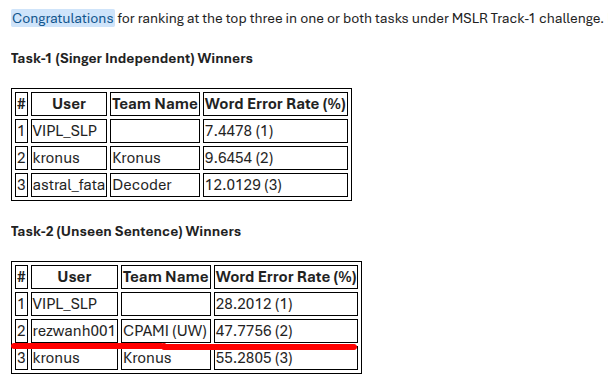
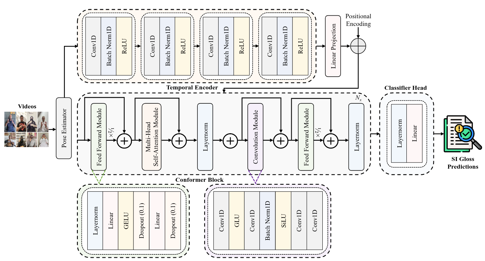
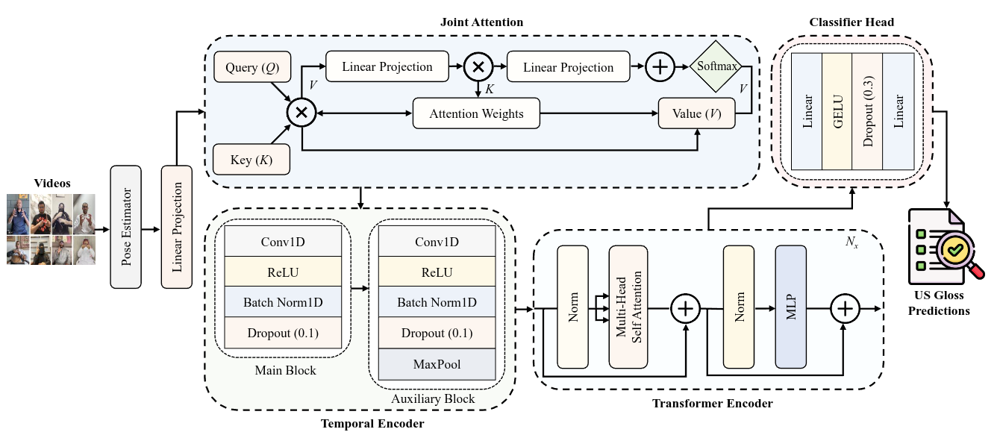

# Pose Estimation for MSLR CSLR Track
---
- ***Team Name:*** **CPAMI (UW)**
- **Final Standing:**


---


Welcome to the Pose Estimation repository! This repository contains the starter kit for the **MSLR CSLR Track** and provides a simple baseline for two important tasks in Continuous Sign Language Recognition (CSLR).

The tasks include:
1. **Signer Independent** [View Competition](https://www.kaggle.com/competitions/continuous-sign-language-recognition-iccv-2025)
2. **Unseen Sentences** [View Competition](https://www.kaggle.com/competitions/continuous-slr-task-2-iccv-2025)

## Propossed models Architecture:

### Proposed Architecture: Signer-Invariant Conformer (for SI Task)

<!-- [**View the Model Diagram (PDF)**](Assets/Challenge%2011.pdf) -->


*__Figure 1: Signer-Invariant Conformer.__ Our proposed architecture for signer-independent CSLR begins by extracting pose keypoints from video frames. An initial temporal encoder, composed of convolutional layers, learns local features from this pose sequence. The core of the model consists of conformer blocks that capture global context with multi-head self-attention and extract local patterns using convolution. Positional encodings are exploited to provide the model with sequence order information. Finally, a linear classifier head analyzes the sequence representation to generate sign gloss predictions.*

---

### Proposed Architecture: Multi-Scale Fusion Transformer (for US Task)



*__Figure 1: Multi-Scale Fusion Transformer.__ Multi-Scale Fusion Transformer: An overview of the proposed architecture for the unseen sentences CSLR task. The network first uses a pose estimator to retrieve keypoint data. The features are then processed by a temporal encoder with a dual-path design: a main block records fine-grained temporal dynamics, and an auxiliary block uses max-pooling to learn downsampled representations.  The outputs of both blocks are combined to provide a comprehensive feature set. This is subsequently analyzed by a transformer encoder, which models the sequence's long-range relationships. A joint attention mechanism reweights feature values before they are passed to the classification phase. The output sequence is fed into a classifier head, which generates the US gloss predictions.*

---

## Update_MSLR-2025 (follow this folder for updated code)
---
---
- `cd Update_MSLR-2025/`

#### run the code for both training and inference 

- mode = SI (train)
```bash
python run.py --train --mode SI --model SOTA_CSLR
```

- mode = SI (infer)
```bash
python run.py --infer --mode SI --model SOTA_CSLR
```

---

- mode = US (train)
```bash
python run.py --train --mode US --model AdvancedSignLanguageRecognizer
```

- mode = US (infer)
```bash
python run.py --infer --mode US --model AdvancedSignLanguageRecognizer
```

---
---


---

### Model Performance (US Mode)

|        Model                   | Mode | Dev (WER) | Test (WER) |
|--------------------------------|------|-----------|------------|
| llm_advslowfast                | US   | 93.0663 | ...        |
| gcn_transformer                | US   | 91.7951   | ...        |
| mixllama                       | US   | 86.9029   | ...        |
| LLM Backbone (DistilBERT)      | US   | 81.7026   | ...        |
| slowfast                       | US   | 81.3174   | ...        |
| LSTM                           | US   | 79.9307   | ...        |
| SignLanguageConformer          | US   | 77.5039   | ...        |
| SignLanguageRecognizer         | US   | 74.9614   | ...        |
| SOTA_CSLR                      | US   | 64.4838   | ...        |
| MambaSignLanguageRecognizer    | US   | 59.514    | ...        |
| **AdvancedSignLanguageRecognizer** | **US** | **55.0847** | **47.7756** |

---

### Model Performance (SI Mode)

| Model                          | Mode | Dev (WER) | Test (WER) |
|-------------------------------|------|-----------|------------|
| llm_advslowfast               | SI   | 43.8955   | 72.2365    |
| MambaSignLanguageRecognizer   | SI   | 29.3149   | 37.2774    |
| AdvancedSignLanguageRecognizer| SI   | 27.5362   | 33.9069    |
| mixllama + slowfastllm        | SI   | 30.1274   | 46.9831    |
| mixllama                      | SI   | 21.8270   | 51.2139    |
| LSTM                          | SI   | 17.0180   | 26.0755    |
| slowfastllm                   | SI   | 16.7106   | 42.5878    |
| SignLanguageConformer         | SI   | 16.2495   | 26.6290    |
| SignLanguageRecognizer        | SI   | 14.5367   | 22.6229    |
| **SOTA_CSLR**                 | **SI** | **7.3123** | **13.0652** |

---

## Baseline Overview

### 4.3 Baselines

To evaluate the performance of our proposed models, we compare them against a suite of baseline architectures implemented for this study. These baselines span a range of established and recent approaches in sequence modeling, from classic recurrent networks to modern hybrid architectures incorporating Large Language Models (LLMs). The performance of each baseline on the Isharah-1000 Signer-Independent (SI) and Unseen-Sentences (US) tasks is reported.

-   **LLM-SlowFast (`llm_advslowfast`):** This model adapts the SlowFast concept to pose data, with parallel Transformer pathways processing the sequence at different temporal resolutions. It further attempts to inject linguistic knowledge by concatenating features from a pretrained XLM-RoBERTa model before the final classifier. This complex architecture performed poorly, achieving a high test WER of 72.24% for the SI task and a development set WER of 93.07% for the US task.

-   **LLaMA-Former (`mixllama`):** This baseline uses a standard Transformer encoder to process pose features, which are then fed into a frozen LLaMA-2 model to act as a powerful sequential processor. This approach explores leveraging the advanced sequence modeling capabilities of a large generative LLM. It achieved a test WER of 51.21% in the SI task and an 86.90% development set WER for the US task.

-   **LLaMA-SlowFast (`mixllama + slowfastllm`):** A hybrid of the previous two, this model uses LLaMA-2 and a SlowFast architecture to extract multi-rate temporal features from pose data. The fused visual features are then processed by an AraBERT model [1]. This intricate fusion of visual and linguistic models yielded a test WER of 46.98% for the SI task.

-   **ST-GCN-Conformer (`gcn_transformer`):** This model first employs a Spatial-Temporal Graph Convolutional Network (ST-GCN) to learn features directly on the skeletal graph [2]. This front-end explicitly models the physical connections between body joints over time. The output of the ST-GCN is then processed by a Conformer encoder to capture the long-range sequential relationships between these learned spatio-temporal features. Despite its sophisticated design for modeling skeletal structure, this model struggled significantly with the linguistic generalization required for the US task, achieving a high development set WER of 91.80%.

-   **DistilBERT-Former (`LLM Backbone (DistilBERT)`):** This model first processes the pose sequence using a standard Transformer encoder to capture visual-temporal dependencies. The resulting feature embeddings are then fed into a pretrained DistilBERT model [3], using it as a powerful, general-purpose sequence processor instead of a simple classifier. This approach aims to leverage the linguistic and contextual knowledge inherent in the LLM backbone. However, the model struggled with the task, achieving a high development set WER of 81.70% in the US task.

-   **Mamba-Sign (`MambaSignLanguageRecognizer`):** This model utilizes a hybrid Mamba-Transformer block, leveraging the linear-time sequence modeling strengths of Mamba alongside the global context capabilities of attention. It replaces standard recurrent or purely attention-based backbones with this recent state-space model architecture [4]. On the SI task, Mamba-Sign achieved a test WER of 37.28%. On the US task, this model gained a development set WER of 59.51%.

-   **BiLSTM (`LSTM`):** This is a classic CSLR baseline consisting of a simple Bidirectional Long Short-Term Memory (BiLSTM) network [5]. It processes the pose features directly to capture temporal dependencies. This foundational model serves as a strong reference point, achieving a competitive test WER of 26.08% in the SI task and a 79.93% development set WER for the US task.

-   **Sign-Conformer (`SignLanguageConformer`):** This baseline adapts the Conformer architecture, which has shown great success in speech recognition, to the sign language domain. It combines convolutions and self-attention to capture both local and global dependencies in the pose sequence [6]. It performed comparably to the BiLSTM, with a test WER of 26.63% in the SI task and a very high development set WER of 77.50% for the US task.

-   **CNN-BiLSTM (`SignLanguageRecognizer`):** Our strongest baseline combines a TCN front-end with a BiLSTM backbone. The convolutional layers first extract and downsample local spatio-temporal features, which are then modeled by the BiLSTM to capture long-range dependencies. This simple yet effective hybrid architecture achieved the best performance among all baselines, with a test WER of 22.62% in the SI task. Alternatively, in the US task with this same model, we got a comparatively high WER of 74.96%.

---
**References**

[1] Antoun, W., Baly, F., & Hajj, H. (2020). AraBERT: Transformer-based Model for Arabic Language Understanding. *arXiv preprint arXiv:2003.00104*.

[2] Yan, S., Xiong, Y., & Lin, D. (2018). Spatial temporal graph convolutional networks for skeleton-based action recognition. *AAAI*.

[3] Sanh, V., Debut, L., Chaumond, J., & Wolf, T. (2019). DistilBERT, a distilled version of BERT: smaller, faster, cheaper and lighter. *arXiv preprint arXiv:1910.01108*.

[4] Gu, A., & Dao, T. (2023). Mamba: Linear-Time Sequence Modeling with Selective State Spaces. *arXiv preprint arXiv:2312.00752*.

[5] Hochreiter, S., & Schmidhuber, J. (1997). Long short-term memory. *Neural computation*, 9(8), 1735-1780.

[6] Gulati, A., et al. (2020). Conformer: Convolution-augmented transformer for speech recognition. *Interspeech*.
---

## Setup Instructions

Follow these steps to set up the environment and get started:

1. **Clone the repository**:
   ```bash
   git clone https://github.com/gufranSabri/Pose86K-CSLR-Isharah.git
   cd Pose86K-CSLR-Isharah
   ```

2. **Download the dataset** from [here](https://www.kaggle.com/competitions/continuous-sign-language-recognition-iccv-2025/data). Place the dataset in the `./data` folder.

3. **Set up the Python environment**:
   - Install `virtualenv`:
     ```bash
     pip install virtualenv
     ```

   - Create a virtual environment and activate it:
     ```bash
     python<version> -m venv pose
     source pose/bin/activate  # On Windows: pose\Scriptsctivate
     ```

   - Install the required dependencies:
     ```bash
     pip install torch==1.13 torchvision==0.14 tqdm numpy==1.23.5 pandas opencv-python
     git clone --recursive https://github.com/parlance/ctcdecode.git
     cd ctcdecode && pip install .
     ```


## Running the Model
Once your environment is ready and the data is in place, you can run the main script using the following format:
```
python main.py \
  --work_dir ./work_dir/test \
  --data_dir ./data \
  --mode SI \
  --model base \
  --device 0 \
  --lr 0.0001 \
  --num_epochs 300
```

### Argument Descriptions
 * ```--work_dir:``` Path to store logs and model checkpoints (default: ./work_dir/test)
 * ```--data_dir:``` Path to the dataset directory (default:``` /data/sharedData/Smartphone/)
 * ```--mode:``` Task mode, either SI (Signer Independent) or US (Unseen Sentences)
 * ```--model:``` Model variant to use (base, or any other available variant)
 * ```--device:``` GPU device index (default: 0)
 * ```--lr:``` Learning rate (default: 0.0001)
 * ```--num_epochs:``` Number of training epochs (default: 300)

You can modify these arguments as needed for your experiments.

### Example Command

- Task-1:
```
python main.py --work_dir ./work_dir/base_SI --model base --mode SI
```

- Task-2:
```
python main.py --work_dir ./work_dir/base_US --model base --mode US
```

## Usage

Once the environment is set up, you can train or test the model on the available tasks. Follow the instructions in the individual task directories for specific commands.

### Running the Script for Inference the best model

#### Task-1 (SI)
```bash
python inference_submission.py \
    --work_dir ./work_dir/base_SI \
    --mode SI \
    --model base \
    --device 0 \
    --output_dir ./submission/task-1
```

#### Task-2 (US)
```bash
python inference_submission.py \
    --work_dir ./work_dir/base_US \
    --mode US \
    --model base \
    --device 0 \
    --output_dir ./submission/task-2
```

Replace `--model base` with `llm`, `slowfast`, `stgcn_conformer`, or `st_transformer` depending on the model used. Update `work_dir` to match the training directory containing `best_model.pt`.

### Running `test_evaluate.py` the best model

#### Task-1 (SI)
```bash
python test_evaluate.py --work_dir ./work_dir/llm_advslowfast_SI --model llm_advslowfast --mode SI --device 0
```

#### Task-2 (US)
```bash
python test_evaluate.py --work_dir ./work_dir/llm_advslowfast_US --model llm_advslowfast --mode US --device 1
```


```
MSLR-Pose86K-CSLR-Isharah/
│
├── main.py                      # Main training/validation script
├── inference_submission.py      # Inference and submission script
├── data_loader_test.py          # dataloader process for the test set only
├── test_script.py               # testing dataset
│
├── models/
│   ├── transformer.py           # Transformer-based CSLR model(s)
│   └── gcn_transformer.py       # gcn-based transfromer (other model)
│
├── utils/
|   ├── datasetv2.py             # processing the dataset 
│   ├── decode.py                # Decoding utilities (CTC, beam search, etc.)
│   ├── evaluation_script.py     # sample evaluation
│   ├── metrics.py               # various MT evaluation metrics.
│   └── text_ctc_utils.py        # CTC predictions into gloss sequences.
|   
│
├── data/
│   ├── public_si_dat/           # this database for task-1
|   |   ├── train.csv            # train.csv with `arabic` text in gloss col (2 cols: id, gloss)
|   |   ├── dev.csv              # dev.csv, similary
|   |   ├── pose_data_isharah1000_hands_lips_body_May12.pkl   # pose data for training and validation          
│   |   └── pose_data_isharah1000_SI_test.pkl                 # pose data for testing  
│   └── public_us_dat/           # this database for task-2
|       ├── train.csv            # train.csv with `arabic` text in gloss col (2 cols: id, gloss)
|       ├── dev.csv              # dev.csv, similary
|       ├── pose_data_isharah1000_hands_lips_body_May12.pkl   # pose data for training and validation 
|       └── pose_data_isharah1000_SI_test.pkl                 # pose data for testing  
├── work_dir/                    # Training logs, checkpoints, outputs
│   └── ...                      # (Organized by experiment/run)
│
├── requirements.txt             # Python dependencies                 
└── README.md                    # Project description and instructions 

```

## License

This project is licensed under the MIT License.
